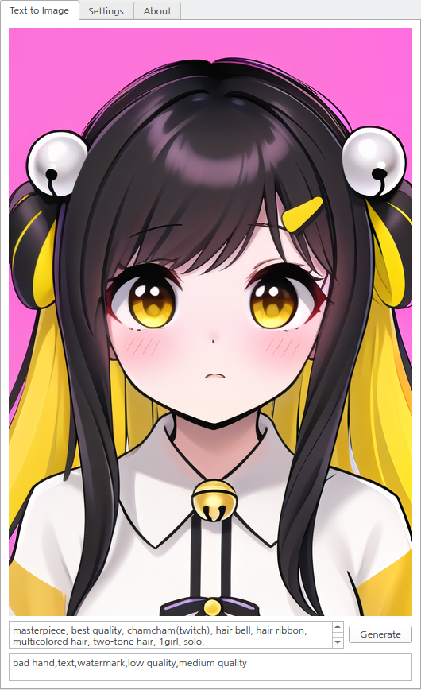

# fasteasysd_UI

fasteasySD_UI is a UI implementation project for the fasteasySD library

you can use any SD, SD1.5, SDXL Model and any custom Lora with LCM_LoRA.

and even use this with cpu only.
 
### most of the UI structures used in this project are the results of borrowing and revising from fastsdcpu.

fastsdcpu : https://github.com/rupeshs/fastsdcpu.git

## UI 

 

## install

**You must have a working Python installation.(Recommended : Python 3.10 or 3.11 )**

### windows :

Clone/download this repo or download release.

### Installation

 - Double click `install.bat`  (It will take some time to install,depending on your internet speed.)

#### Run Desktop GUI
- To start desktop GUI double click `start.bat`

### Linux + Mac :

Clone/download this repo or download release.

### Installation

 - open terminal, go to fasteasysd_UI directory

 - Run following command 
    
    `chmod +x install.sh`

    `./install.sh`
 - when install process done Run command
    
    `./start.sh`

## Usage

### Text to Image Tab

simple stable diffusion Text to image UI

It simply consists of a postive and negative prompt input and an image creation button.

### Settings Tab

Tab for setting SD model and SD LoRa.

HW Type : Set HW for inference, cpu or cuda (default : cpu)

(core ML implement is Future planning now)

Model Type : Set the model type you want to use. (SD,SDXL,SSD-1B,LCM)

Base Model : The path of the SD model to be used is directly set or explored.

lora : The path of the LoRa model to be used is directly set or explored.

Other settings can be used according to the user's preference.

But I strongly recommend use steps > 4 and Guidance scale = 2 when using custom LoRa 

